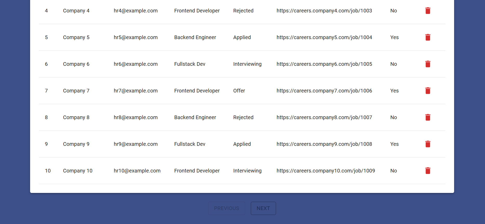
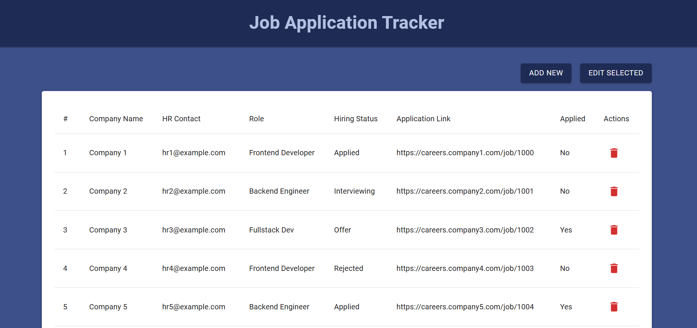

# Job Application Tracker

A simple and user-friendly web application to track your job applications. Add, edit, and monitor job opportunities, hiring statuses, contacts, and application links — all in one place.

## Screenshots

  


---

## Tech Stack

- **Frontend**: React
- **Backend**: Node.js
- **Database**: MongoDB

---

## Installation

```bash
# Clone the repository
git clone https://github.com/doona1/Job-Tracker.git
cd Job-Tracker

# Install backend dependencies
cd backend
npm install

# Install frontend dependencies
cd ../frontend
npm install


